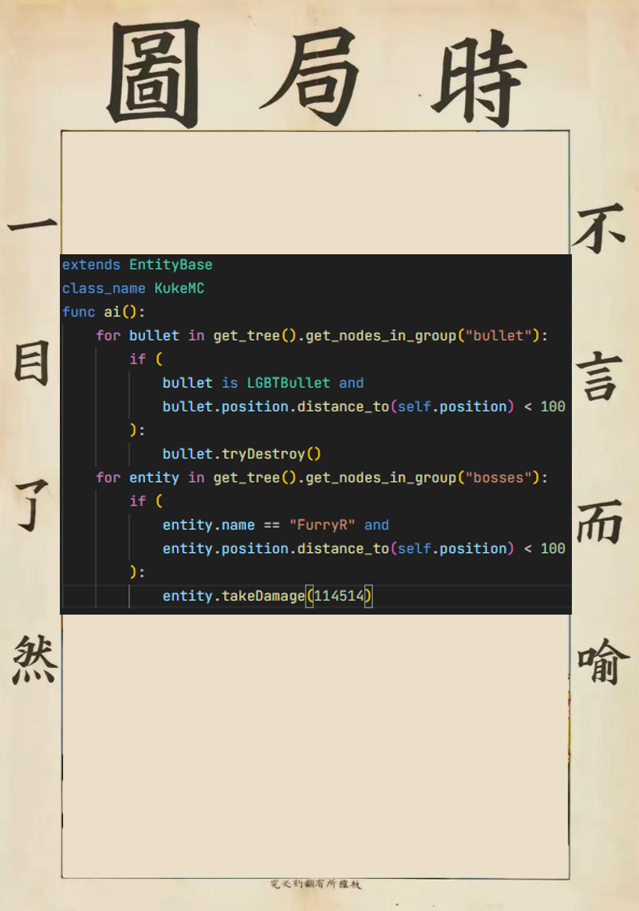

# 公鸡大战狗熊

这是一个用于恶搞的Godot4.3唐人游戏，无Spine。
游戏类型：波次制Rougeli**t**e。

英文名：**ReasterBeat**。

- **Reaster**为单词**Rooster（公鸡）**与**Bear（狗熊）**的嵌合体。
- **Beat**本意为“打击；节奏”，此处引申为“打斗”。
- 组合两词，意译为“公鸡大战狗熊”。
- **不存在任何性暗示**哈，请不要过度解读。
游戏玩法详见[Gameplay](./gameplay.md)

## boss清单

- 小鸡【**原创**】
- 酷可mc【[**CCW**](https://www.ccw.site/student/610b508176415b2f27e0f851)】
- 熊谷 凌【[**CCW**](https://www.ccw.site/student/672a23df6a88e30e6e0d4c9c)】

- ~~感觉不如**SCLAWLET** × **HORGAN**~~

## 波次预设表

| 角色名  | 最小数量 | 最大数量 | 是否boss | 开始波次 | 结束波次 | 波次间隔 |
|---------|----------|----------|----------|----------|----------|----------|
| 母鸡    | 1        | 5        | ×        | 1        | +INF     | 1        |
| 熊谷 凌 | 0        | 0        | √        | 20       | +INF     | 10       |
| 小鸡    | 0        | 0        | √        | 10       | +INF     | 15       |
| 酷可MC  | 0        | 0        | √        | 15       | +INF     | 20       |

## 角色出招表

（不存在任何影射和暗喻哈，请不要过度解读。）

### 小鸡

- **狱炎**：玩家距离0~200时每隔2秒攻击，喷出**狱炎**造成伤害。
- **冷冻激光**：玩家距离200~700时每隔12秒攻击，生成2~4条自旋的激光，每条造成的伤害无dot。
- **猛冲**：每隔3秒攻击，向玩家方向高速冲刺，伤害与速度为正相关。
- **钻石雨**：每隔0.4秒攻击，生成7-16个钻石，追踪玩家。
- 当玩家距离>700时，按5,1的权重随机选择触发**钻石雨**或**猛冲**。

### 熊谷 凌

- **七彩矢1**：生成20-30个**七彩矢**，向玩家随机位置发射。
- **七彩矢2**：生成8-12个**七彩矢**，呈圆形分布。
- **太阳舞**：发射13个**日珥**，呈圆形扩散。
- **永恒彩虹**：发射多个**永恒彩虹**，速度逐渐减慢并旋转。
- **猛冲**：快速移到玩家左侧或右侧快速向玩家冲刺并造成伤害。
- **空灵长枪1**：生成20-30个**空灵长枪**，呈圆形分布。
- **空灵长枪2**：在玩家周围随机位置生成16个**空灵长枪**。
- **空灵长枪3**：生成多轮**空灵长枪**，旋转包围玩家。
- 当生命值低于50%时，进入二阶段，移速+10%，攻击速度+5%，伤害+25%。
- 正常流程下，**熊谷 凌**不会进入第三阶段，但每次**熊谷 凌**生成时，都有1%的概率直接进入第三阶段，届时其将转换为**神圣·熊谷 凌**，伤害+9999%。
- 其余详见[泰拉瑞亚·光之女皇](https://terraria.wiki.gg/zh/wiki/%E5%85%89%E4%B9%8B%E5%A5%B3%E7%9A%87)
- ~~如果你以某种方式触发了一个彩蛋，也许可以看到**熊谷 凌**与酷可mc对打（？）。但是别想去翻源码找触发方式，这块的代码已经扣了。~~

### 酷可MC

- **散射水晶**：以较低的精准度发射8-16个**紫水晶**。
- **小弟**：当生命值低于50%时，可以每隔5秒召唤1-2个**酷可小弟**协助战斗。
- 当生命值低于25%时，杀死所有召唤的小弟进行回复并额外恢复200点血量，但此后无法再召唤小弟。
- **大风车**：逐渐发射40-50个**紫水晶**，呈风车状旋转。
- **重晶投射**：每隔2秒召唤一个**动力水晶**，瞄准玩家1秒后发射，伤害与速度为正相关。
- 检测靠近的所有**七彩飞星**，不管是谁发射的，都将其摧毁。不宜使用此武器与**酷可MC**战斗。
↑这个设定的原因详见[游戏源代码](https://github.com/Rundll86/ChickenVSBear)早期Commit或《时局图》

### 酷可小弟

- **链式机枪**：向玩家高速发射低伤害的**微型紫水晶**。
- **重晶投射**：生成时召唤一个**动力水晶**，瞄准玩家1秒后发射，伤害与速度为正相关。
- 如果被召唤后10秒内玩家未消灭此小弟，则此小弟会被**酷可MC**杀死并为其恢复100点血量。

### 母鸡

- **陨星**：以较低的精准度发射1-4个**星星**。
